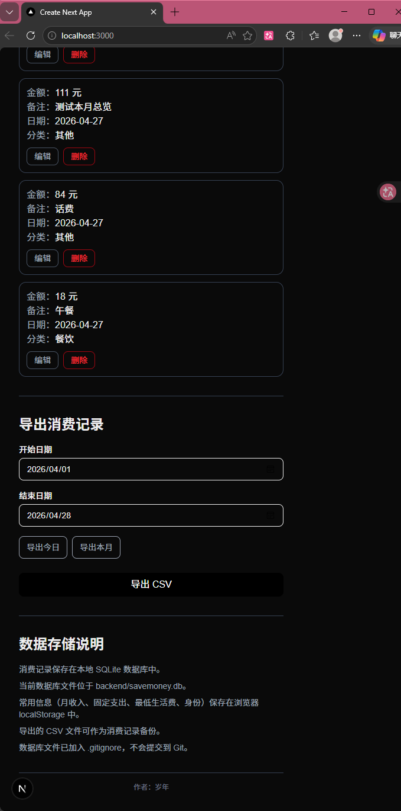

# SaveMoney

一个用于攒钱计划生成、消费记录、消费分析和 AI 辅助记账的 Web 全栈项目。

当前版本是 **Web 全栈版**，前端使用 Next.js + React + TypeScript + Tailwind CSS，后端使用 FastAPI + SQLite + SQLAlchemy + Pydantic。项目适合在电脑和手机浏览器中使用，也适合作为完整 Web 全栈学习项目。

## 已完成功能

- 快速记录消费：金额、备注、日期、分类
- 消费记录列表展示、编辑、删除
- 每日消费汇总
- 按日期范围统计消费分类
- 本月总览：总消费、消费笔数、日均消费、分类明细
- CSV 导出消费记录
- 攒钱计划生成：根据收入、固定支出、目标和截止日期计算每日需存
- 动态调整攒钱计划
- 常用收入和支出信息保存到浏览器 localStorage
- AI 月度消费分析
- AI 消费分类建议，失败时回退本地规则
- AI 消费备注优化
- 后端接口回归测试
- GitHub Actions 基础 CI

## 技术栈

- **前端**：Next.js / React / TypeScript / Tailwind CSS
- **后端**：FastAPI / Python / SQLAlchemy / Pydantic
- **数据库**：SQLite
- **AI**：DeepSeek API
- **测试与质量**：pytest / unittest 兼容测试、ESLint、Next build、GitHub Actions

## 项目结构

```text
SaveMoney/
├─ backend/
│  ├─ app/
│  │  ├─ routers/          # FastAPI 路由
│  │  ├─ services/         # 业务逻辑
│  │  ├─ utils/            # 日期、金额、CSV 等工具
│  │  ├─ main.py           # 创建 app、注册 CORS 和 routers
│  │  ├─ models.py         # SQLAlchemy 模型
│  │  ├─ schemas.py        # Pydantic 入参/出参
│  │  └─ budget_engine.py  # 攒钱计划计算
│  ├─ tests/               # 后端测试
│  └─ requirements.txt
├─ frontend/
│  ├─ app/
│  │  ├─ components/       # 页面组件
│  │  ├─ hooks/            # 前端 hooks
│  │  ├─ lib/              # API 客户端
│  │  ├─ page.tsx          # 页面组合入口
│  │  └─ types.ts          # TypeScript 类型
│  └─ package.json
├─ docs/images/            # 项目截图
└─ .github/workflows/ci.yml
```

## 本地运行

前提：装好 Python 3.10+ 和 Node.js 18+。

### 1. 安装依赖

```bash
# 后端依赖
cd backend
pip install -r requirements.txt pytest

# 前端依赖
cd frontend
npm install
```

### 2. 配置环境变量

在 `backend/` 目录下创建 `.env` 文件，内容参考 `backend/.env.example`：

```text
DEEPSEEK_API_KEY=你的DeepSeek_API_Key
DEEPSEEK_BASE_URL=https://api.deepseek.com
DEEPSEEK_MODEL=deepseek-chat
```

没有配置 API Key 也可以正常使用攒钱计划、消费记录、统计和 CSV 导出等基础功能。

### 3. 启动后端

```powershell
cd backend
.\.venv\Scripts\Activate.ps1
uvicorn app.main:app --reload --host 127.0.0.1 --port 8000
```

后端地址：

```text
http://127.0.0.1:8000
```

接口文档：

```text
http://127.0.0.1:8000/docs
```

### 4. 启动前端

```bash
cd frontend
npm run dev
```

前端地址：

```text
http://localhost:3000
```

## 运行检查

```bash
# 后端测试
cd backend
pytest

# 如果本地没有安装 pytest，也可以先用当前兼容测试方式：
python -m unittest discover -s tests -v

# 前端检查
cd frontend
npm run lint
npm run build
```

## 环境变量说明

| 变量 | 说明 | 位置 |
|---|---|---|
| `DEEPSEEK_API_KEY` | DeepSeek API Key，用于 AI 功能 | `backend/.env` |
| `DEEPSEEK_BASE_URL` | DeepSeek API 地址 | `backend/.env` |
| `DEEPSEEK_MODEL` | 使用的模型名称 | `backend/.env` |
| `SAVEMONEY_DATABASE_URL` | 后端数据库连接地址，默认使用 `backend/savemoney.db` | 后端环境变量（可选，主要用于测试） |
| `NEXT_PUBLIC_API_BASE_URL` | 前端连接的后端地址，默认 `http://127.0.0.1:8000` | `frontend/.env.local`（可选） |

请勿将真实 API Key 提交到 Git。`backend/.env` 已在 `.gitignore` 中。

## 稳定性与工程化

- 后端 `main.py` 只负责创建 app、注册 CORS 和 routers
- 后端业务逻辑拆分到 `routers/`、`services/`、`utils/`
- 前端 `page.tsx` 只负责组合组件和页面级刷新状态
- 前端类型、API 请求、localStorage 逻辑已独立封装
- 首屏优先展示“记一笔消费”，按钮和输入框适配移动端操作
- AI 分类失败时回退本地规则，普通记账不依赖 AI
- AI JSON 返回支持 Markdown 代码块容错解析
- 生产环境不打印 API key 或完整 AI 响应
- 金额处理集中封装为 Decimal 边界处理，避免到处直接操作 float

## 金额精度说明

当前数据库沿用已有的 `amount` 字段，以“元”为单位保存。为了避免破坏已有 SQLite 数据，本次没有直接迁移为 `amount_cents` 字段，而是在服务层增加金额处理工具，统一进行 Decimal 舍入和统计。

如果后续要迁移到“分”为单位保存，建议步骤：

1. 备份 `backend/savemoney.db`
2. 新增 `amount_cents` 整数字段
3. 写一次性迁移脚本，将旧 `amount` 转换为 `round(amount * 100)`
4. API 继续对外接收和返回“元”
5. 验证统计、导出和编辑功能后，再移除旧字段

## 数据存储说明

消费记录保存在本地 SQLite 数据库中：

```text
backend/savemoney.db
```

常用信息（月收入、固定支出、最低生活费、身份）保存在浏览器 localStorage 中。数据库文件和环境变量文件都已加入 `.gitignore`，不会提交到 GitHub。

## 项目截图

截图位于 `docs/images/`，用于展示当前 Web 版核心页面。后续如果界面继续调整，可以替换同名图片保持 README 展示同步。




## 常见问题

### 前端提示后端未响应

请确认后端已启动，并能访问：

```text
http://127.0.0.1:8000/health
```

如果后端端口不是 8000，请在 `frontend/.env.local` 设置 `NEXT_PUBLIC_API_BASE_URL`。

### AI 服务不可用

AI 月度分析、AI 分类建议和 AI 备注优化需要在 `backend/.env` 配置 `DEEPSEEK_API_KEY`。未配置时，普通记账、查询、导出仍可使用；AI 分类会尽量回退到本地规则。

### 数据库文件在哪里

默认数据库文件是 `backend/savemoney.db`。迁移或重装环境前建议先备份。

## 后续计划

- 继续增强预算分析维度
- 增加前端组件测试
- 提供 SQLite 金额字段迁移脚本
- 如果需要移动端，单独开发 Android 原生版

## 注意事项

- 本项目主要用于个人学习和作品展示
- AI 结果仅作为辅助参考，不一定完全准确
- 不要提交 `.env`、真实 API Key 或本地数据库文件

## 许可证

MIT License，详见 [LICENSE](./LICENSE)。

## 作者

岁年
