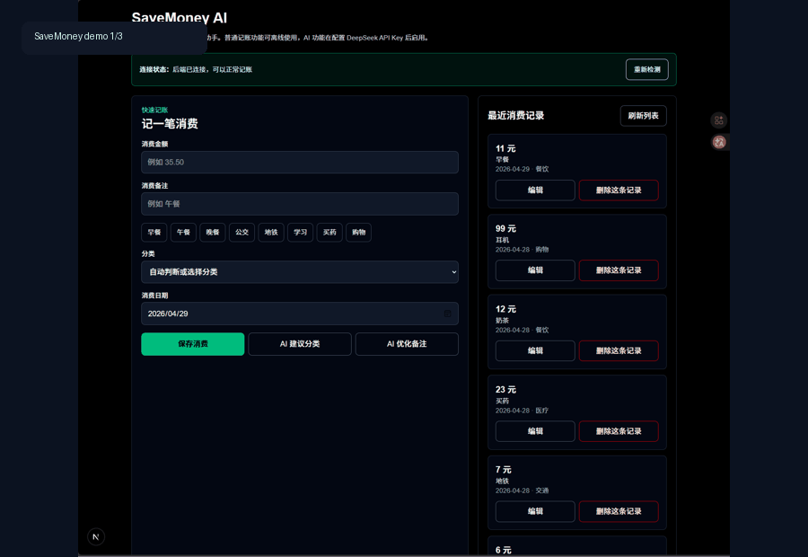

# SaveMoney

一个用于攒钱计划生成、消费记录、消费分析和 AI 辅助记账的 Web 全栈项目。

当前版本是 **Web 全栈版**，前端使用 Next.js + React + TypeScript + Tailwind CSS，后端使用 FastAPI + SQLite + SQLAlchemy + Pydantic。项目适合在电脑和手机浏览器中使用，也适合作为完整 Web 全栈学习项目。

## 演示



## 项目亮点

- **完整个人记账闭环**：从攒钱计划、记账、统计、AI 辅助到备份恢复，覆盖个人使用的主流程。
- **本地优先的数据策略**：默认使用 SQLite，本地运行成本低，备份文件可直接迁移。
- **金额精度逐步治理**：API 保持“元”的易用接口，数据库内部逐步迁移为整数分，兼顾兼容性和精度。
- **AI 非强依赖设计**：AI 未配置或服务失败时，核心记账能力不受影响。
- **工程化可验证**：后端测试、前端 lint/build/test、GitHub Actions 和 Docker Compose 都已接入。

## 技术难点

- **旧库兼容迁移**：项目不要求用户手动重建数据库，启动时会补齐旧 SQLite 表结构并回填 cents 字段。
- **备份恢复安全边界**：恢复前会校验上传文件是否为 SQLite、是否通过 `PRAGMA integrity_check`、是否包含 SaveMoney 核心表和字段。
- **统一错误响应与前端兼容**：后端统一返回 `{ error: { code, message, details } }`，前端 API client 同时兼容旧版 `detail` 字段。
- **前端无新增依赖测试**：少量前端单测使用 TypeScript 编译加 Node 内置 test runner，避免额外引入测试框架。
- **容器化和本地开发并存**：Docker Compose 使用独立 SQLite 数据卷，同时保留原有本地 Python/Node 启动方式。

## 已完成功能

- 快速记录消费：金额、备注、日期、分类、支付方式、必要性标记
- 消费记录列表展示、编辑、删除
- 消费列表分页、日期筛选、分类筛选、关键词搜索，并带服务端分页边界校验
- 消费记录筛选面板自适应布局，窄屏和侧栏视图下日期输入不会被挤压
- 每日消费汇总
- 按日期范围统计消费分类
- 本月总览：总消费、消费笔数、日均消费、分类明细
- CSV 导出消费记录
- 攒钱计划生成：根据收入、固定支出、目标和截止日期计算每日需存
- 攒钱计划持久化：自动保存到数据库，首页展示当前计划和进度
- 动态调整攒钱计划
- 常用收入和支出信息保存到浏览器 localStorage
- 数据库备份/恢复：一键下载数据库、从备份文件恢复、导入 CSV
- 备份恢复前校验 SQLite 文件、核心 schema 和 integrity check
- AI 月度消费分析（优雅降级：未配置 Key 时返回友好提示）
- AI 消费分类建议，失败时回退本地规则
- AI 消费备注优化（未配置 Key 时返回原始备注）
- 可选 API 访问令牌认证
- 后端接口回归测试
- 少量前端 API client 单元测试
- Docker Compose 一键启动
- GitHub Actions 基础 CI

## 技术栈

- **前端**：Next.js / React / TypeScript / Tailwind CSS
- **后端**：FastAPI / Python / SQLAlchemy / Pydantic
- **数据库**：SQLite
- **AI**：DeepSeek API
- **测试与质量**：pytest / unittest 兼容测试、ESLint、Next build、GitHub Actions

## 项目结构

```text
SaveMoney/
├─ backend/
│  ├─ app/
│  │  ├─ routers/          # FastAPI 路由（expenses, plans, ai, backup）
│  │  ├─ services/         # 业务逻辑（expense_service, plan_service, ai_service）
│  │  ├─ utils/            # 日期、金额、CSV、备份等工具
│  │  ├─ main.py           # 创建 app、注册 CORS 和 routers
│  │  ├─ models.py         # SQLAlchemy 模型（Expense, SavingPlan）
│  │  ├─ schemas.py        # Pydantic 入参/出参
│  │  ├─ auth.py           # 可选 Bearer Token 认证
│  │  └─ budget_engine.py  # 攒钱计划计算
│  ├─ scripts/             # 数据库迁移脚本
│  ├─ tests/               # 后端测试
│  └─ requirements.txt
├─ frontend/
│  ├─ app/
│  │  ├─ components/       # 页面组件（ExpenseForm, ExpenseList, PlanForm, BackupPanel 等）
│  │  ├─ hooks/            # 前端 hooks
│  │  ├─ lib/              # API 客户端
│  │  ├─ page.tsx          # 页面组合入口
│  │  └─ types.ts          # TypeScript 类型
│  ├─ e2e/                 # Playwright 端到端测试
│  ├─ tests/               # 前端单元测试
│  ├─ playwright.config.ts # Playwright 测试配置
│  └─ package.json
├─ docs/images/            # 项目截图
└─ .github/workflows/ci.yml
```

## 架构图

```text
Browser
  │
  │  Next.js / React UI
  │  - 记账、统计、计划、备份面板
  │  - 统一 API client 处理鉴权、JSON、文件上传和 Blob 下载
  ▼
FastAPI Backend
  │
  ├─ routers/      # HTTP 路由和请求参数校验
  ├─ services/     # 业务规则：消费、计划、AI 降级
  ├─ utils/        # 金额、日期、CSV、备份、AI JSON 解析
  └─ auth.py       # 可选 Bearer Token
  │
  ├──────────────► DeepSeek API（可选）
  │                  未配置或分类失败时走本地规则/友好降级
  ▼
SQLite
  - 本地消费记录和攒钱计划
  - 金额逐步迁移为整数分字段，API 对外仍使用元
```

## 核心设计说明

- **API 边界保持简单**：前端和后端接口仍使用“元”为金额单位，避免 UI 和用户输入复杂化。
- **数据库金额逐步整数化**：消费记录和攒钱计划都会同步保存浮点元字段与整数分字段；新计算优先使用整数分字段，旧字段保留用于兼容历史数据。
- **启动兼容迁移**：后端启动时会为旧 SQLite 表补齐新增字段，并回填 cents 字段，降低本地项目升级成本。
- **服务层承载业务规则**：routers 主要做 HTTP 参数接收，分类、汇总、计划持久化、AI 降级等逻辑集中在 services。
- **AI 是增强能力，不是主链路依赖**：未配置 DeepSeek API Key 时，普通记账、统计、备份都正常可用；分类建议可回退本地规则。
- **前端 API client 单入口**：`frontend/app/lib/api-client.ts` 统一处理 base URL、访问令牌、JSON 请求、文件上传和下载错误。
- **备份按当前数据库配置执行**：设置 `SAVEMONEY_DATABASE_URL` 时，备份和恢复会作用于该 SQLite 文件，而不是固定默认路径。

## 本地运行

前提：装好 Python 3.10+ 和 Node.js 18+。

### Docker Compose 一键启动

前提：装好 Docker Desktop 或 Docker Engine。

```bash
docker compose up --build
```

启动后访问：

```text
前端：http://localhost:3000
后端：http://127.0.0.1:8000
接口文档：http://127.0.0.1:8000/docs
```

Compose 默认把 SQLite 数据库保存到 `savemoney-data` volume。需要配置 AI 或访问令牌时，可在仓库根目录创建 `.env`：

```text
DEEPSEEK_API_KEY=
SAVEMONEY_ACCESS_TOKEN=
NEXT_PUBLIC_SAVEMONEY_ACCESS_TOKEN=
NEXT_PUBLIC_API_BASE_URL=http://127.0.0.1:8000
```

### 1. 安装依赖

```bash
# 后端依赖
cd backend
pip install -r requirements.txt

# 前端依赖
cd frontend
npm install
```

### 2. 配置环境变量

在 `backend/` 目录下创建 `.env` 文件，内容参考 `backend/.env.example`：

```text
DEEPSEEK_API_KEY=你的DeepSeek_API_Key
DEEPSEEK_BASE_URL=https://api.deepseek.com
DEEPSEEK_MODEL=deepseek-chat

# 可选：设置访问令牌以保护后端 API（不设置则不启用认证）
SAVEMONEY_ACCESS_TOKEN=
```

没有配置 API Key 也可以正常使用攒钱计划、消费记录、统计、CSV 导出、备份恢复等基础功能。AI 功能在配置 Key 后启用。

### 3. 启动后端

```powershell
cd backend
.\.venv\Scripts\Activate.ps1
uvicorn app.main:app --reload --host 127.0.0.1 --port 8000
```

后端地址：

```text
http://127.0.0.1:8000
```

接口文档：

```text
http://127.0.0.1:8000/docs
```

### 4. 启动前端

```powershell
cd frontend
npm run dev
```

前端已默认使用 webpack 启动 Next 开发服务器，避免 Turbopack 在部分 Windows 电脑上导致高 CPU/内存占用。

前端地址：

```text
http://localhost:3000
```

## 运行检查

```bash
# 后端测试
cd backend
python -m pytest tests

# 前端检查
cd frontend
npm run lint
npm test
npm run build

# 可选：端到端测试
npm run e2e
```

前端应用构建的 TypeScript 范围只覆盖应用代码；`tests/`、`e2e/` 和 `playwright.config.ts` 由独立测试命令检查，避免 `next build` 在 CI 构建阶段误检查 Playwright 配置。

## 环境变量说明

| 变量 | 说明 | 位置 |
|---|---|---|
| `DEEPSEEK_API_KEY` | DeepSeek API Key，用于 AI 功能 | `backend/.env` |
| `DEEPSEEK_BASE_URL` | DeepSeek API 地址 | `backend/.env` |
| `DEEPSEEK_MODEL` | 使用的模型名称 | `backend/.env` |
| `SAVEMONEY_ACCESS_TOKEN` | 可选访问令牌，保护后端 API | `backend/.env` |
| `SAVEMONEY_DATABASE_URL` | 后端数据库连接地址，默认使用 `backend/savemoney.db` | 后端环境变量（可选，主要用于测试） |
| `NEXT_PUBLIC_API_BASE_URL` | 前端连接的后端地址，默认 `http://127.0.0.1:8000` | `frontend/.env.local`（可选） |
| `NEXT_PUBLIC_SAVEMONEY_ACCESS_TOKEN` | 前端访问令牌（与后端一致） | `frontend/.env.local`（可选） |

请勿将真实 API Key 提交到 Git。`backend/.env` 已在 `.gitignore` 中。

## 安全说明

- **仅本机使用**：默认配置仅供本地使用，不要将后端暴露到公网
- **局域网访问**：如需手机访问，请配置 `SAVEMONEY_ACCESS_TOKEN` 并在前端设置 `NEXT_PUBLIC_SAVEMONEY_ACCESS_TOKEN`
- 未配置访问令牌时，所有接口无需认证即可访问

## 稳定性与工程化

- 后端 `main.py` 只负责创建 app、注册 CORS 和 routers
- 后端业务逻辑拆分到 `routers/`、`services/`、`utils/`
- 前端 `page.tsx` 只负责组合组件和页面级刷新状态
- 前端类型、API 请求、文件上传下载、localStorage 逻辑已独立封装
- 首屏优先展示"记一笔消费"，按钮和输入框适配移动端操作
- 右侧消费列表和导出面板使用响应式宽度，避免日期、筛选项在侧栏中拥挤或截断
- AI 功能全部优雅降级：未配置 Key 时返回友好提示而非 500 错误
- AI 分类失败时回退本地规则，普通记账不依赖 AI
- AI JSON 返回支持 Markdown 代码块容错解析
- 生产环境不打印 API key 或完整 AI 响应
- 金额处理集中封装为 Decimal 边界处理，避免到处直接操作 float
- 后端汇总接口使用数据库聚合和整数分字段计算，减少内存开销并降低浮点误差
- 后端启动时会自动补齐旧 SQLite 数据库缺失字段，并为旧消费记录和攒钱计划回填 cents 字段
- 消费列表会校验日期范围、`limit` 和 `offset`，避免异常查询参数造成无效或过大的查询
- 数据库备份会跟随 `SAVEMONEY_DATABASE_URL`，测试库或自定义数据库不会误指向默认库
- 数据库恢复前会校验 SQLite 文件、核心 schema 和 `PRAGMA integrity_check`
- 配置访问令牌时，前端数据库备份下载会通过标准 `Authorization` 请求头鉴权
- 后端错误响应统一为 `{ error: { code, message, details } }`，前端 API client 统一读取错误信息
- 所有查询参数使用 URLSearchParams 编码，避免特殊字符问题

## 金额精度说明

消费记录同时保存 `amount`（浮点元）和 `amount_cents`（整数分）两个字段。攒钱计划也会保存 `target_amount_cents`、`monthly_income_cents`、`fixed_expenses_cents`、`minimum_living_cost_cents`、`saved_amount_cents`。API 继续对外接收和返回"元"，数据库和汇总计算逐步优先使用"分"。

后端启动时会自动为旧版 SQLite 数据库补齐 `amount_cents`、`payment_method`、`is_necessary` 和计划表 cents 字段，并把旧记录的元字段回填为整数分。存量数据也可通过迁移脚本手动补填：

```bash
cd backend
python -m scripts.migrate_to_cents
```

## 数据存储与备份

消费记录保存在本地 SQLite 数据库中：

```text
backend/savemoney.db
```

如果设置了 `SAVEMONEY_DATABASE_URL`，后端和备份功能会使用该连接地址指向的 SQLite 文件。

常用信息（月收入、固定支出、最低生活费、身份）保存在浏览器 localStorage 中。数据库文件和环境变量文件都已加入 `.gitignore`，不会提交到 GitHub。

### 备份功能

前端提供完整的备份与恢复功能：

- **下载数据库备份**：一键下载整个 SQLite 数据库文件
- **从备份文件恢复**：上传 `.db` 文件覆盖当前数据库（自动备份旧库）
- **导入 CSV**：上传消费记录 CSV 文件批量导入

恢复数据库前，后端会先验证上传文件是否为可读取 SQLite、`PRAGMA integrity_check` 是否通过，以及是否包含 SaveMoney 所需的核心表和字段；校验通过后才会备份当前库并执行替换。

如果启用了 `SAVEMONEY_ACCESS_TOKEN`，前端会在备份下载、恢复和导入请求中携带访问令牌。

**迁移或重装环境前，务必先下载数据库备份！**

## 项目截图


## 常见问题

### 前端提示后端未响应

请确认后端已启动，并能访问：

```text
http://127.0.0.1:8000/health
```

如果后端端口不是 8000，请在 `frontend/.env.local` 设置 `NEXT_PUBLIC_API_BASE_URL`。

### AI 服务不可用

AI 月度分析、AI 分类建议和 AI 备注优化需要在 `backend/.env` 配置 `DEEPSEEK_API_KEY`。未配置时，普通记账、查询、导出仍可使用；AI 分类会回退到本地规则，AI 备注优化返回原始备注，AI 月度分析返回友好提示。

### 数据库文件在哪里

默认数据库文件是 `backend/savemoney.db`。迁移或重装环境前请先使用前端"备份与恢复"功能下载数据库备份。

### 消费记录或本月总览提示加载失败

如果你从旧版本升级，旧版 `backend/savemoney.db` 可能缺少新字段。当前版本会在后端启动时自动补齐 SQLite 表结构；也可以在 `backend/` 目录运行 `python -m scripts.migrate_to_cents` 手动迁移后再刷新页面。

## 后续计划

### P0：马上值得做

- [x] 统一前端 API client
- [x] 给备份恢复、金额计算、AI 降级补测试
- [x] 把消费和攒钱计划金额字段逐步迁移到整数分
- [x] README 增加架构图和核心设计说明
- [x] 备份恢复前校验 SQLite、schema 和 integrity check
- [x] Docker Compose 一键启动
- [x] 少量前端测试
- [x] 统一错误响应格式
- [x] README 增加项目亮点、技术难点、演示 GIF

### P1：项目成熟度提升

- 引入 Alembic 管理数据库迁移
- 把分类和支付方式配置化
- 增加日志系统并统一日志格式
- 前端继续补齐空状态、错误状态、加载状态
- 继续补前端组件测试

### P2：如果未来想部署或给别人用

- 加入用户系统
- 后端改成真正的鉴权授权模型
- 备份接口单独保护
- 增强生产环境 Docker Compose，例如反向代理、HTTPS 和健康检查
- 数据库从 SQLite 可选迁移到 PostgreSQL
- 增加数据导入前预览和操作审计

## 注意事项

- 本项目主要用于个人学习和作品展示
- AI 结果仅作为辅助参考，不一定完全准确
- 不要提交 `.env`、真实 API Key 或本地数据库文件

## 许可证

MIT License，详见 [LICENSE](./LICENSE)。

## 作者

岁年
